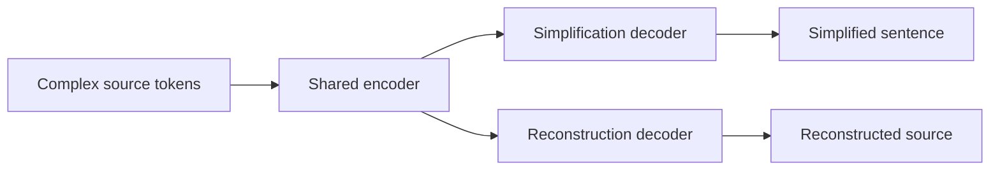

# Dual-Decoder Transformer for English Text Simplification

## Project context

This project maps a complex English sentence to a simpler English sentence. The historical
implementation in `src/custom_transformer.py` is intentionally unchanged so its results remain
traceable. The corrected single-decoder comparison model and the new dual-decoder model live in
`src/dual_decoder_transformer.py`.

The controlled experiments use WikiLarge, a vocabulary built only from the selected training
split, whitespace tokenization, teacher forcing, and greedy decoding. The local runs use 2,000
training pairs, 200 validation pairs, the existing 191-pair test split, five epochs, batch size 8,
and seed 42.

## Historical and corrected baselines

The historical encoder-decoder uses learned token and position embeddings, stacked self-attention
encoder blocks, and a causal decoder with encoder-decoder cross-attention. Audit of the historical
file found two independent implementation issues:

1. Attention logits were divided by `sqrt(embed_size)`. Scaled dot-product attention must divide
   by `sqrt(head_dim)`, where `head_dim = embed_size / heads`.
2. The decoder target mask was causal but did not exclude target padding keys.

The historical E0 result is not silently replaced. E0 is labeled historical and unretrained. E1
is the corrected controlled baseline and is the valid architectural comparator for E2-E9.

## Dual-decoder architecture

The encoder parameters are shared. The simplification and reconstruction decoders have separate
embeddings, attention blocks, feed-forward blocks, and output projections. This prevents direct
parameter tying from making the auxiliary task trivial while forcing both tasks to use the same
encoder representation.

During normal inference, `generate_simplification` calls only the simplification decoder. The
reconstruction decoder is used during training and for diagnostic reconstruction output.

## Attention and masking

For one attention head, projected queries and keys have width `d_k = head_dim`. Attention is:

\[
\operatorname{Attention}(Q,K,V) =
\operatorname{softmax}\left(\frac{QK^\top}{\sqrt{d_k}} + M\right)V.
\]

Source masks have shape `(batch, 1, 1, source_length)` and hide source padding keys. Target masks
have shape `(batch, 1, target_length, target_length)` and are the Boolean conjunction of:

- a lower-triangular causal mask, which hides future keys; and
- a target key-padding mask, which hides `<pad>` keys.

Cross-attention uses decoder states as queries and the shared encoder output as keys and values.

## Teacher forcing and loss

For a tokenized simplified target `[<sos>, y1, ..., <eos>]`, the simplification decoder consumes
all tokens except the final token and predicts all tokens except `<sos>`. Reconstruction applies
the identical shift to the complex source sequence.

Both cross-entropy losses ignore `<pad>`. The objective is:

\[
L = L_{\mathrm{simplification}} + \lambda L_{\mathrm{reconstruction}}.
\]

`lambda` controls how strongly the shared encoder is encouraged to retain source information.
The sweep tests 0.25, 0.50, and 1.00. Weighted total losses should not be compared directly across
different values of `lambda`; they contain different amounts of reconstruction loss.

## Feed-forward activation

The ReLU block is:

\[
\operatorname{FFN}(x) = W_o\operatorname{ReLU}(W_i x + b_i) + b_o.
\]

SwiGLU is implemented as a real gated unit, not as a SiLU substitution:

\[
\operatorname{SwiGLU}(x) = W_o\left[(W_vx+b_v)\odot
\operatorname{SiLU}(W_gx+b_g)\right]+b_o.
\]

The additional gate projection increases parameters. At the controlled 8-head setting, E5 has
19,600,788 trainable parameters versus 18,811,284 for E4.

## Positional encoding

`learned` adds a learned absolute position embedding to each token embedding, preserving the
historical behavior.

`rope` removes learned absolute position embeddings and rotates projected queries and keys before
attention scores are computed. It is applied in encoder self-attention, decoder self-attention,
and encoder-decoder cross-attention. RoPE requires an even head dimension. It does not change mask
semantics.

## Attention heads

The model validates `embed_size % heads == 0`. With embedding size 256:

| Heads | Head dimension |
| ---: | ---: |
| 4 | 64 |
| 8 | 32 |
| 16 | 16 |

Changing the head count changes how representation capacity is partitioned, not the overall
embedding width. Small parameter differences arise from the historical per-head projection
structure.

## Controlled experiment matrix

| ID | Architecture | Lambda | Activation | Positions | Heads |
| --- | --- | ---: | --- | --- | ---: |
| E0 | Historical single decoder | 0 | ReLU | Learned | 4 |
| E1 | Corrected single decoder | 0 | ReLU | Learned | 8 |
| E2 | Dual decoder | 0.25 | ReLU | Learned | 8 |
| E3 | Dual decoder | 0.50 | ReLU | Learned | 8 |
| E4 | Dual decoder | 1.00 | ReLU | Learned | 8 |
| E5 | Dual decoder | selected | SwiGLU | Learned | 8 |
| E6 | Dual decoder | selected | ReLU | RoPE | 8 |
| E7 | Dual decoder | selected | ReLU | Learned | 4 |
| E8 | Dual decoder | selected | ReLU | Learned | 16 |
| E9 | Dual decoder | selected combination | selected | selected | selected |

Selection uses an unweighted rank sum over available SARI, BERTScore F1, entity preservation,
Flesch-Kincaid grade, and validation simplification loss. Number preservation is included when the
evaluated split contains numeric tokens. This rule makes trade-offs explicit and avoids choosing
on total validation loss alone.

## Observed controlled results

The complete table is in
`results/transformer_experiments/comparison/report_table.md`. The selected reconstruction weight
was 1.00. E8 was the strongest tested dual configuration under the balanced rule, so E9 uses ReLU,
learned positions, 16 heads, and lambda 1.00.

The evidence does not establish that the dual decoder is universally better than E1. E9 improves
ROUGE-L, BLEU, token F1, and spaCy entity preservation slightly, but E1 has better BERTScore F1 and
substantially easier output according to Flesch-Kincaid. Entity preservation is very low for every
model, and the lowercased WikiLarge representation contains no measurable numeric tokens in this
test split. Qualitative outputs show severe generic-output collapse. These limitations must remain
visible in any report.

## Hypotheses and interpretation boundaries

- Reconstruction may regularize the shared representation, but only a small entity-retention gain
  was observed and semantic similarity decreased relative to E1.
- SwiGLU may provide a richer feed-forward mapping; E5 improved BERTScore and readability over its
  matched E4 configuration but reduced SARI and increased cost.
- RoPE may change length generalization; E6 had the highest SARI but much worse readability and
  semantic/overlap metrics in this controlled run.
- More heads are not automatically better. Sixteen heads produced the best balanced dual result,
  while four heads retained a higher SARI than sixteen.

These are interpretations of controlled associations, not causal claims beyond the tested setup.

## File-level implementation guide

- `src/custom_transformer.py`: preserved historical implementation.
- `src/dual_decoder_transformer.py`: corrected attention, masks, configurable components, E1, and
  dual-decoder architecture.
- `src/training/transformer_experiment.py`: data encoding, loss computation, checkpointing,
  reproducibility, generation, and metrics.
- `src/pipeline/transformer_experiments.py`: CLI, E1-E9 dependency order, selection, status, and
  comparison generation.
- `configs/transformer_experiments.json`: human-readable experiment manifest.
- `tests/test_dual_decoder_transformer.py`: model, mask, attention, configuration, and generation
  tests.
- `tests/test_transformer_experiment.py`: loss, checkpoint, and resume tests.
- `scripts/slurm/` and `scripts/*transformer_pipeline*.sh`: managed server and fallback execution.

Together, these changes demonstrate the role of per-head scaling, causal and padding masks,
encoder sharing, decoder separation, cross-attention, gated feed-forward networks, rotary
positions, teacher forcing, auxiliary objectives, and controlled ablation design.

## Limitations

- Training on 2,000 examples is intentionally controlled but insufficient for high-quality free
  generation with a 12,746-token vocabulary.
- Whitespace tokenization and `<unk>` handling are weak compared with subword tokenization.
- Greedy decoding can amplify generic-output collapse.
- WikiLarge normalization lowercases names and removes numeric values from this test split, which
  weakens entity evaluation and makes number preservation unavailable.
- Only one seed was run, so differences do not include uncertainty estimates.
- E9 reproduces E8 because the deterministic selected configuration is identical; its separate run
  verifies the selection pipeline rather than adding an independent statistical replicate.
